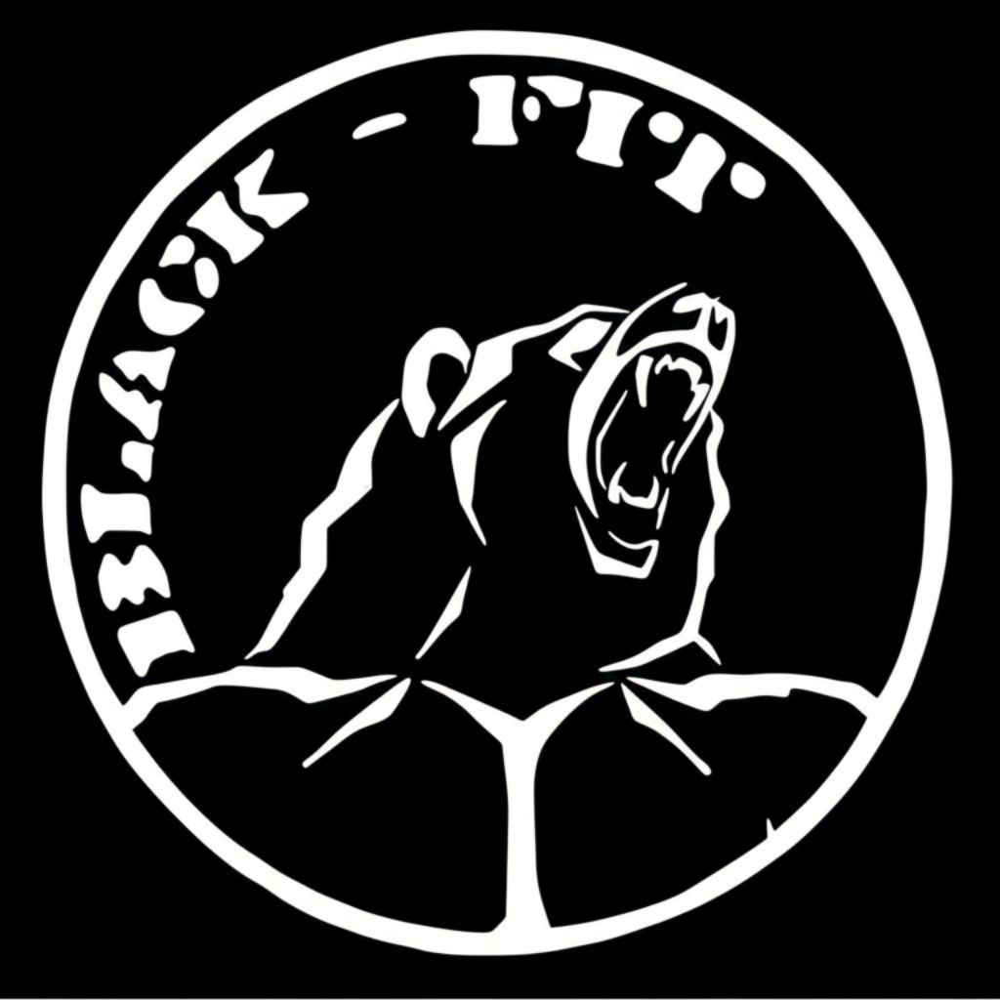

# Black-Fit Spor Merkezi - Sivas

Sivas'taki Black-Fit Spor Merkezi için modern, responsive React uygulaması. Şık tasarım, animasyonlar ve sezgisel kullanıcı arayüzü ile premium fitness deneyimi sunar.



## Özellikler

- **Etkileyici UI/UX**: Video hero bölümü, animasyonlu bileşenler ve yumuşak geçişler
- **Responsive Tasarım**: Tüm cihaz boyutları için tam optimize edilmiş
- **Modern Mimari**: React 19 ve styled-components ile inşa edilmiş
- **İnteraktif Elementler**: Modal formlar, animasyonlu kartlar ve kaydırma efektleri
- **Performans Optimizasyonu**: Hızlı yükleme ve yumuşak animasyonlar

## Ana Bölümler

- Video arka planlı hero bölümü
- Özellikler vitrini
- Fitness programları
- Profesyonel eğitmenler
- Wellness hizmetleri
- Müşteri yorumları

## Teknolojiler

- React 19
- Styled Components
- Framer Motion
- React Router DOM
- React Intersection Observer
- react-helmet-async (SEO/meta tags)

## Başlangıç

### Gereksinimler

- Node.js (v16 veya üzeri)
- npm veya yarn

### Kurulum

1. Repository'yi klonlayın
```bash
git clone https://github.com/yourusername/black-fit-gym.git
cd black-fit-gym
```

2. Bağımlılıkları yükleyin
```bash
npm install
# veya
yarn install
```

3. Geliştirme sunucusunu başlatın
```bash
npm start
# veya
yarn start
```

4. Tarayıcınızda [http://localhost:3000](http://localhost:3000) adresini açın

## Production için Build

```bash
npm run build
# veya
yarn build
```

Build dosyaları `build` klasöründe, deployment için hazır olacaktır.

## Proje Yapısı

```
black-fit-gym/
├── public/
├── src/
│   ├── assets/
│   ├── components/
│   │   ├── layout/
│   │   ├── sections/
│   │   └── ui/
│   ├── context/
│   ├── data/          # siteConfig.js — central content/config source
│   ├── hooks/
│   ├── pages/
│   ├── styles/
│   └── utils/
└── package.json
```

## Lisans

MIT

## Yazar

Selim Koc
